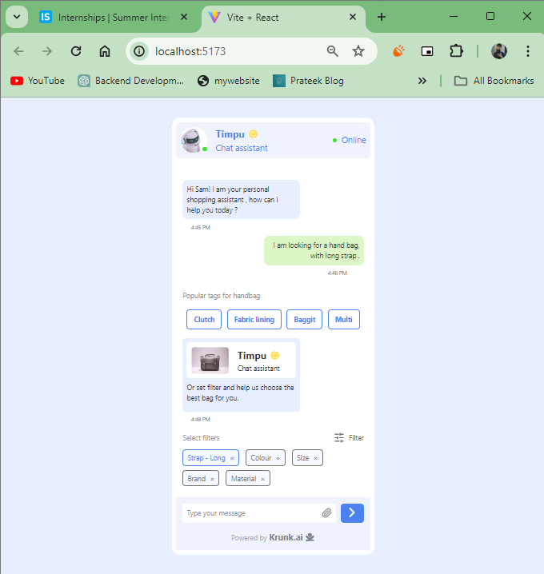
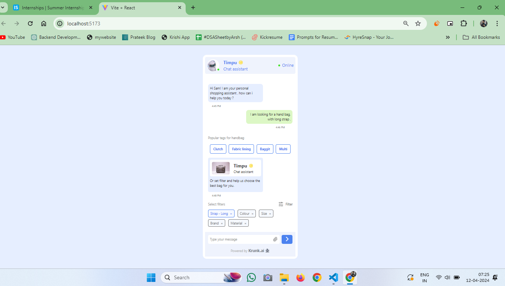

# Timpu Chat Assistance

This is a simple web application Frontend for chat App.
## Table of Contents

- [Prerequisites](#prerequisites)
- [Getting Started](#getting-started)
- [Project Structure](#project-structure)

## Prerequisites

Before running this project, make sure you have the following installed:

- Node.js: You can download and install it from [nodejs.org](https://nodejs.org/).

## Getting Started

1. Clone this repository to your local machine:

   ```bash
   git clone https://github.com/Prateek043/Krunk-Technologies-Private-Limited.git

2. Navigate to the project directory:
    ```bash
    cd Krunk-Technologies-Private-Limited
3. Install the project dependencies:
    ```bash
    npm install


### Start the development server:

### Frontend
```bash
npm run dev
```

## Screenshots




